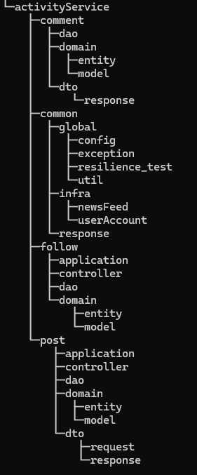

# 소셜 미디어 기반의 예약 구매 서비스
- 특정 시간에 상품을 구매할 수 있는 서비스로서 상품 등록, 주문, 결제 기능을 제공하며 대규모 트래픽 처리를 대비합니다.

## 개발 기간
- 총 4주(2024.01.24.~2024.02.22.)

## 사용 기술
- Language : JDK 11
- Build Tool : Gradle
- Library&Framework : Spring Boot, Spring Cloud, JWT
- Database : MySQL, Redis
- ORM : Hibernate
- DevOps : Docker, Github
- Testing Tools : JUnit, Artillery

## 프로젝트 시작하기
* Start with Docker
```shell
git clone https://github.com/bokyoung89/pre-order-service.git
docker-compose -f docker-compose.yml up
```

## 주요 기능
* 예약 구매를 위한 상품 등록, 주문 생성, 결제 프로세스 기능
* Redis Cache를 활용한 실시간 재고관리 서비스
* JWT 토큰 생성 및 검증을 통한 로그인, 로그아웃 기능
* JavaMailSender와 Gmail의 SMTP 서버를 활용한 이메일 인증 기능
* 사용자의 뉴스피드 생성, 친구들의 포스트를 최신순으로 가져오는 기능
* 포스트, 댓글 CRUD, 좋아요, 팔로우 등 유저 활동 서비스

## File Structure
* MSA Module Structure


* Module File Structure



## API 명세서
* [전체 API 명세서](https://sbk8689.gitbook.io/pre-order-service-api/)
### (sample) 팔로우 API
```json
curl --location --request POST 'http://localhost:8083/activity-service/follow/2' \
--header 'Authorization: Bearer token'
```
Response 200 
```json
{
    "resultCode": "SUCCESS",
    "result": null
}
```

## 요구사항 구현 및 트러블 슈팅
*  [전체 문서 링크](https://sbk8689.gitbook.io/pre-order-service/)
* 주요 이슈
  * [요구사항 구현] [프로젝트 DB 결정 - RDBMS 그리고 MySQL 선택 이유](https://sbk8689.gitbook.io/pre-order-service/)
  * [트러블 슈팅] [API Gateway에 공통 인증 필터 구현으로 서비스 간 의존성 제거](https://sbk8689.gitbook.io/pre-order-service/)